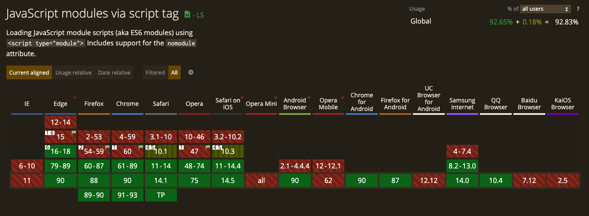

# Transpile Vue SFC To ES Modules

将 Vue SFC 转化为 ES Modules

<div class="pt-12">
  <span @click="$slidev.nav.next" class="px-2 p-1 rounded cursor-pointer" hover="bg-white bg-opacity-10">
    Getting Started <carbon:arrow-right class="inline"/>
  </span>
</div>

<a href="https://github.com/slidevjs/slidev" target="_blank" alt="GitHub"
  class="abs-br m-6 text-xl icon-btn opacity-50 !border-none !hover:text-white">
  <carbon-logo-github />
</a>

---
layout: image-left
image: https://source.unsplash.com/collection/94734566/1920x1080
---
# 未来前端工程构建

### 下一代构建工具

2021 年的今天，已经涌现出了一批新的，可以称之为下一代的前端构建工具，例如 `esbuild`、`snowpack`、`vite`、`wmr` 等等。

可以看看这篇文章[《Comparing the New Generation of Build Tools》](https://css-tricks.com/comparing-the-new-generation-of-build-tools/)，从**工具配置**、**开发服务**、**生产构建**、**构建SSR**等方面分析比较了前端下一代的构建工具。

---
layout: image-left
image: https://source.unsplash.com/collection/94734566/1920x1080
---

# 浏览器原生构建

### 在浏览器中使用 JavaScript 模块

现代浏览器已经原生支持加载 `ES Modules` ，需要将 `type="module"` 放到 `<script>` 标签中，来声明这个脚本是一个模块，例如：

```html
<script type="module">
  // include script here
</script>
```

这样就可以在脚本中使用 `import` 、`export` 语句了



---
layout: image-right
image: https://source.unsplash.com/collection/94734566/1920x1080
---

# 浏览器原生构建

### 在 Node.js 中处理依赖关系

现代前端工程开发环境中，会根据 `package.json` 来描述模块之间的依赖关系，安装模块后，所有模块会放在`node_modules` 文件夹下。例如 package.json 中描述依赖了lodash：

```json {5}
{
  "name": "test",
  "version": "0.0.1",
  "dependencies": {
    "lodash": "^4.17.21"
  }
}
```

---
layout: image-right
image: https://source.unsplash.com/collection/94734566/1920x1080
---

# 浏览器原生构建

### 在浏览器中处理依赖关系

类似的，在浏览器中处理模块之间的依赖关系，目前有一个新的提案 `import-maps`

通过声明 `<script>` 标签的属性 `type` 为 `importmap`，来定义模块的名称和模块地址之间的映射关系

例如：

```json {4}
<script type="importmap">
{
  "imports": {
    "lodash": "https://cdn.jsdelivr.net/npm/lodash@4.17.21/lodash.min.js"
  }
}
</script>
```

---
layout: image-right
image: public/images/sfc.png
---
# 什么是 Vue SFC?

### Vue 生态里 [SFC](https://v3.vuejs.org/guide/single-file-component.html#introduction) 是 single-file components (单文件组件) 的缩写

通过扩展名 `.vue` 来描述了一个 Vue 组件

**功能特性：**
  
- 📝 [完整语法高亮](https://github.com/vuejs/awesome-vue#source-code-editing)
- 📦 [CommonJS 模块](https://webpack.js.org/concepts/modules/#what-is-a-webpack-module)
- 🎨 [组件作用域的 CSS](https://vue-loader.vuejs.org/en/features/scoped-css.html)

<style>
h1 {
  background-color: #2B90B6;
  background-image: linear-gradient(45deg, #4EC5D4 10%, #146b8c 20%);
  background-size: 100%;
  -webkit-background-clip: text;
  -moz-background-clip: text;
  -webkit-text-fill-color: transparent;
  -moz-text-fill-color: transparent;
}
</style>

---

# 如何编译 Vue SFC?

<br>

Vue 工程需要借助 `vue-loader` 或者 `rollup-plugin-vue` 来将 SFC 文件编译转化为可执行的 JS

<div grid="~ cols-3 gap-4">

<div v-click>

<h3>vue 2</h3>

vue-loader 依赖的是：

* `@vue/component-compiler-utils`
* `vue-style-loader`

</div>

<div v-click>

<h3>vue 3</h3>

vue-loader@next 依赖的是：

* `@vue/compiler-sfc`

</div>

<div v-click>

<h3>vite 2</h3>

@vitejs/plugin-vue 依赖的是：

* `@vue/compiler-sfc`

</div>

<div v-click>
<arrow x1="450" y1="400" x2="450" y2="300" color="#4EC5D4" width="3" />

<arrow x1="750" y1="400" x2="750" y2="300" color="#4EC5D4" width="3" />
</div>

</div>

<style>
h1 {
  background-color: #2B90B6;
  background-image: linear-gradient(45deg, #4EC5D4 10%, #146b8c 20%);
  background-size: 100%;
  -webkit-background-clip: text;
  -moz-background-clip: text;
  -webkit-text-fill-color: transparent;
  -moz-text-fill-color: transparent;
}

h3 {
  color: #4EC5D4;
  opacity: 1 !important;
}
</style>

---
layout: center
class: text-center
---

# @vue/compiler-sfc

Lower level utilities for compiling Vue Single File Components

---

# @vue/compiler-sfc 的 工作原理

编译一个 Vue SFC 组件，需要分别编译组件的 `template`、`script` 和 `style`

<div grid="~ cols-2 gap-4">

<div class="grid-left">

<h3>API</h3>

```bash
                                  +--------------------+
                                  |                    |
                                  |  script transform  |
                           +----->+                    |
                           |      +--------------------+
                           |
+--------------------+     |      +--------------------+
|                    |     |      |                    |
|  facade transform  +----------->+ template transform |
|                    |     |      |                    |
+--------------------+     |      +--------------------+
                           |
                           |      +--------------------+
                           +----->+                    |
                                  |  style transform   |
                                  |                    |
                                  +--------------------+
```

</div>

<div class="grid-right">

<h3>Facade module</h3>

```js
// main script
import script from '/project/foo.vue?vue&type=script'
// template compiled to render function
import { render } from '/project/foo.vue?vue&type=template&id=xxxxxx'
// css
import '/project/foo.vue?vue&type=style&index=0&id=xxxxxx'

// attach render function to script
script.render = render

// attach additional metadata
// some of these should be dev only
script.__file = 'example.vue'
script.__scopeId = 'xxxxxx'

// additional tooling-specific HMR handling code
// using __VUE_HMR_API__ global

export default script
```

</div>

</div>

---

# Vite & Vue SFC Playground

<br>

<div grid="~ cols-3 gap-x-4 gap-y-32">

## Vite 2


> * `@vitejs/plugin-vue`
> * `@vue/compiler-sfc`


## Vue SFC Playground


> * `@vue/compiler-sfc`
> * 实际上 `SFC Playground` 是基于 [@vue/compiler-sfc/dist/compiler-sfc.esm-browser.js](https://github.com/vuejs/vue-next/blob/master/packages/sfc-playground/vite.config.ts#L16) 编译 ES Modules 的


</div>

<style scoped>
img {
  height: 6rem;
}
</style>
---

# 两者编译 SFC 的过程之间的区别？

<br>

`SFC Playground` 中模块的编译源自 `Vite` 中对 `SSR` 的支持

<br>

<div grid="~ cols-2 gap-4">

<v-clicks>

<div>

[Vite](https://github.com/vuejs/vue-next/blob/master/packages/sfc-playground/src/output/moduleCompiler.ts#L72)

- [1. check all import statements and record id -> importName map](https://github.com/vitejs/vite/blob/main/packages/vite/src/node/ssr/ssrTransform.ts#L62)
- [2. check all export statements and define exports](https://github.com/vitejs/vite/blob/main/packages/vite/src/node/ssr/ssrTransform.ts#L86)
- [3. convert references to import bindings & import.meta references](https://github.com/vitejs/vite/blob/main/packages/vite/src/node/ssr/ssrTransform.ts#L142)
</div>

<div>

[SFC Playground](https://github.com/vitejs/vite/blob/main/packages/vite/src/node/ssr/ssrTransform.ts)

- [0. instantiate module](https://github.com/vuejs/vue-next/blob/master/packages/sfc-playground/src/output/moduleCompiler.ts#L65)
- [1. check all import statements and record id -> importName map](https://github.com/vuejs/vue-next/blob/master/packages/sfc-playground/src/output/moduleCompiler.ts#L72)
- [2. check all export statements and define exports](https://github.com/vuejs/vue-next/blob/master/packages/sfc-playground/src/output/moduleCompiler.ts#L99)
- [3. convert references to import bindings](https://github.com/vuejs/vue-next/blob/master/packages/sfc-playground/src/output/moduleCompiler.ts#L158)
- [4. convert dynamic imports](https://github.com/vuejs/vue-next/blob/master/packages/sfc-playground/src/output/moduleCompiler.ts#L192)
- [append CSS injection code](https://github.com/vuejs/vue-next/blob/master/packages/sfc-playground/src/output/moduleCompiler.ts#L209)

</div>

</v-clicks>

</div>

---

# Vite 与 SFC Playground 编译的区别？

编译 HelloWorld.vue

<div grid="~ cols-2 gap-4" v-click>

```js
// /components/HelloWorld.vue
import {defineComponent} from "/node_modules/.vite/vue.js?v=49d3ccd8";
const _sfc_main = defineComponent({
  name: "HelloWorld",
  props: {
    msg: {
      type: String,
      required: true
    }
  }
});

import { toDisplayString as _toDisplayString, openBlock as _openBlock, createBlock as _createBlock } from "/node_modules/.vite/vue.js?v=49d3ccd8"

function _sfc_render(_ctx, _cache, $props, $setup, $data, $options) {
  return (_openBlock(), _createBlock("h1", null, _toDisplayString(_ctx.msg), 1 /* TEXT */))
}


_sfc_main.render = _sfc_render
_sfc_main.__file = "/Users/xiaoyunwei/GitHub/private/slides-vite-demo/src/components/HelloWorld.vue"
export default _sfc_main
```

```js
// ./HelloWorld.vue
const __sfc__ = {
  name: "HelloWorld",
  props: {
    msg: {
      type: String,
      required: true
    }
  }
}

import { toDisplayString as _toDisplayString, openBlock as _openBlock, createBlock as _createBlock } from "vue"

function render(_ctx, _cache, $props, $setup, $data, $options) {
  return (_openBlock(), _createBlock("h1", null, _toDisplayString($props.msg), 1 /* TEXT */))
}
__sfc__.render = render
__sfc__.__file = "HelloWorld.vue"
export default __sfc__
```

</div>

---

# Vite 与 SFC Playground 编译的区别？

编译 App.vue

<div grid="~ cols-2 gap-4" v-click>

```js
// ./App.vue
import {defineComponent} from "/node_modules/.vite/vue.js?v=49d3ccd8";
import HelloWorld from "/src/components/HelloWorld.vue";
const _sfc_main = defineComponent({
  name: "App",
  components: {
    HelloWorld
  }
});

import { resolveComponent as _resolveComponent, openBlock as _openBlock, createBlock as _createBlock } from "/node_modules/.vite/vue.js?v=49d3ccd8"

function _sfc_render(_ctx, _cache, $props, $setup, $data, $options) {
  const _component_HelloWorld = _resolveComponent("HelloWorld")

  return (_openBlock(), _createBlock(_component_HelloWorld, { msg: "Hello Vue 3 + TypeScript + Vite" }))
}


_sfc_main.render = _sfc_render
_sfc_main.__file = "/Users/xiaoyunwei/GitHub/private/slides-vite-demo/src/App.vue"
export default _sfc_main
```

```js
// ./App.vue
import HelloWorld from './HelloWorld.vue'

const __sfc__ = {
  name: 'App',
  components: {
    HelloWorld
  }
}

import { resolveComponent as _resolveComponent, openBlock as _openBlock, createBlock as _createBlock } from "vue"
function render(_ctx, _cache, $props, $setup, $data, $options) {
  const _component_HelloWorld = _resolveComponent("HelloWorld")

  return (_openBlock(), _createBlock(_component_HelloWorld, { msg: "Hello Vue SFC Playground" }))
}
__sfc__.render = render
__sfc__.__file = "App.vue"
export default __sfc__
```

</div>

---
layout: center
class: text-center
---

# 抽象将 SFC 编译为 ES Modules 的能力

<div grid="~ cols-2 gap-4" v-click>

<div>

### vue-sfc2esm

<br>

[](https://github.com/xiaoluoboding/vue-sfc2esm)

</div>

<div>

### vue-sfc-sandbox

<br>

[](https://github.com/xiaoluoboding/vue-sfc-sandbox)

</div>

</div>

---
layout: center
class: text-center
---

# vue-sfc2esm

Transpiled Vue SFC File to ES modules.


---

# vue-sfc2esm <Marker><div class="text-green-500">✨ 功能</div></Marker>

<br>

将 Vue SFC 编译为 ES modules.

<br>

* 💪 基于 TypeScript 编写
* 🌳 TreeShakable & SideEffects Free
* 📁 虚拟文件系统 (支持编译 `.vue/.js` 文件).
* 👬 友好的错误提示

<br>

💡 灵感来自 [Vue SFC Playground](https://github.com/vuejs/vue-next/tree/master/packages/sfc-playground). 

---

# vue-sfc2esm 是如何工作的?

<div grid="~ cols-2 gap-2">

<div>

**核心逻辑**

* `vue-sfc2esm` 内部实现了一个虚拟的 📁 文件系统，用来记录文件和代码的关系。

* `vue-sfc2esm`  会基于 [@vue/compiler-sfc](https://www.npmjs.com/package/@vue/compiler-sfc) 将 SFC 代码编译成 `ES Modules`。

* 编译好的 `ES Modules` 代码可以直接应用于现代浏览器中。

</div>

<div>

**示例：编译 App.vue：**

```html
<script type="module">
import { createApp as _createApp } from "vue"

if (window.__app__) {
  window.__app__.unmount()
  document.getElementById('app').innerHTML = ''
}

document.getElementById('__sfc-styles').innerHTML = window.__css__
const app = window.__app__ = _createApp(__modules__["DefaultDemo.vue"].default)
app.config.errorHandler = e => console.error(e)
app.mount('#app')
</script>
```

</div>

</div>

<div v-click>

💡 使用 ES Modules 模块前，需要提前引入 Vue

```html
<script type="importmap">
  { "imports": { "vue": "https://cdn.jsdelivr.net/npm/vue@next/dist/vue.esm-browser.js" } }
</script>
```

</div>

---
layout: center
class: text-center
---

# vue-sfc-sandbox

Vue SFC Sandbox built on top of `@vue/compiler-sfc`, Sandbox as a Vue 3 component.

<br>

---

# vue-sfc-sandbox <Marker><div class="text-green-500">✨ 功能</div></Marker>

Vue SFC Sandbox 基于 `@vue/compiler-sfc` 构建, Sandbox 作为一个组件使用.

<br>

<div grid="~ cols-2 gap-2 mt-2">

<div>

### 🗳️ SFC 沙盒

<br>

* 💪 基于 TypeScript 编写
* 🌳 TreeShakable & SideEffects Free
* 📁 虚拟文件系统 (支持编译 `.vue/.js` 文件)
* 👬 友好的错误提示，基于 [vue-sfc2esm](https://github.com/xiaoluoboding/vue-sfc2esm)
* 🧪 将 Vue SFC 文件转换为 ES Modules
* 🔌 支持外部 CDN, 比如 [unpkg](https://unpkg.com/)、[jsdelivr](https://www.jsdelivr.com/) 等.
* 🧩 加载 [Import Maps](https://github.com/WICG/import-maps).


</div>

<div>

### ✏️ 编辑器面板

<br>

* 🎨 基于 [codemirror 6](https://codemirror.net/6/) 的代码编辑器。
* 🧑‍💻 对开发者友好, 内建高亮代码, 可交互的面板呈现 REPL 沙盒环境。

### 👓 预览面板

<br>

* ⚡️ 实时编译 SFC 文件
* 🔍 全屏查看

</div>

</div>

---

# vue-sfc-sandbox <Marker><div class="text-pink-500">🖼️ 预览</div></Marker>

<br>

<iframe src="https://codesandbox.io/embed/vue-sfc-sandbox-318nu?fontsize=14&hidenavigation=1&theme=dark&view=preview"
  style="width:100%; height:400px; border:0; border-radius: 4px; overflow:hidden;"
  title="vue-sfc-sandbox"
  allow="accelerometer; ambient-light-sensor; camera; encrypted-media; geolocation; gyroscope; hid; microphone; midi; payment; usb; vr; xr-spatial-tracking"
  sandbox="allow-forms allow-modals allow-popups allow-presentation allow-same-origin allow-scripts"
></iframe>

---

# 相似工程

类似 `codepen`，基于 `Vue` 技术栈可以在线提供编辑器 + 演示的工具

* [vuep](https://github.com/QingWei-Li/vuep) - 🎡 A component for rendering Vue components with live editor and preview.
* [demosify](https://github.com/demosify/demosify) - Create a playground to show the demos of your projects.
* [codepan](https://github.com/egoist/codepan) - Like codepen and jsbin but works offline (*Archived*).


---
layout: center
class: text-center
---

# 工具

* [Vue 3 Template Explorer](https://vue-next-template-explorer.netlify.app/)

---
layout: center
class: text-center
---

# 参考资料

* [ES modules: A cartoon deep-dive](https://hacks.mozilla.org/2018/03/es-modules-a-cartoon-deep-dive/)
* [JavaScript modules 模块](https://developer.mozilla.org/zh-CN/docs/Web/JavaScript/Guide/Modules)
* [import-maps](https://github.com/WICG/import-maps)


---
layout: center
class: text-center
---

# 感谢观看

[vue-sfc2esm](https://github.com/xiaoluoboding/vue-sfc2esm) / [vue-sfc-sandbox](https://github.com/xiaoluoboding/vue-sfc-sandbox)
